<h1>Comment créer une application fermée à la modification et ouverte à l'extension en JAVA</h1>
<h2>Introduction</h2>

Les fonctionnalités que vous codez sont destinées à evoluer, Ce que vous avez implementé aujour'hui ne repondra surement plus au besoins de demain.au niveau des application toujour on veut ajouter ou modifier des fonctionnalités, mais on veut pas casser ce qui fonctionne déjà. Donc il nous préconise de fermer nos classes aux modofications, mais de les ouvrir aux extensions,D'une certaine manière, on verouille ce qui marche deja et on se concentre sur les nouveautés, au final, cest moins couteux. Plutot que modifier une classe,on va en ajouter une qui heritera ou implémentera un niveau d'abstraction plus haut

<h2>Enoncé</h2>

Conception et realisation d'une application en java ouverte a l'extension fermée a la modification on utilisant le concept d'inversion de controle et l'injection des dependeces

<h2>Conception et architecture</h2>
<h3>Couplege faible</h3>
<ul>
<li>Pour utiliser le couplage faible, nous devons utiliser les interfaces.</li>
<li> Considérons une classe A qui implémente une interface IA, et une classe B qui implémente une interface IB.</li>
<li> Si la classe A est liée à l’interface IB par une association, on dit que le classe A et la classe B sont liées par un 
couplage faible.</li>
<li>Cela signifie que la classe B peut fonctionner avec n’importe quelle classe qui implémente l’interface IA.</li>
<li> En effet la classe B ne connait que l’interface IA. De ce fait n’importe quelle classe implémentant cette 
interface peut être associée à la classe B, sans qu’il soit nécessaire de modifier quoi que se soit dans la classe 
B.</li>
<li> Avec le couplage faible, nous pourrons créer des application fermée à la modification et ouvertes à 
l’extension.</li>
</ul>

<h3>Inversion de contrôle</h3>
<ul>
<li> Permettre au développeur de s’occuper uniquement du code métier (Exigences 
fonctionnelles) et c’est le Framework qui s’occupe du code technique (Exigences Techniques)
Securire,mode transactional...</li>
</ul>
<h3>Injection de dépendances</h3>

L’injection de dépendances (Dependency Injection) est un mécanisme qui permet d’implémenter le principe de l’inversion de contrôle. Il consiste à créer dynamiquement (injecter) les dépendances entre les différentes classes en s’appuyant sur une description (fichier de configuration ou métadonnées) ou de manière programmatique. Ainsi les dépendances entre composants logiciels ne sont plus exprimées dans le code de manière statique mais déterminées dynamiquement à l’exécution.

<h3>Architecture d'application</h3>
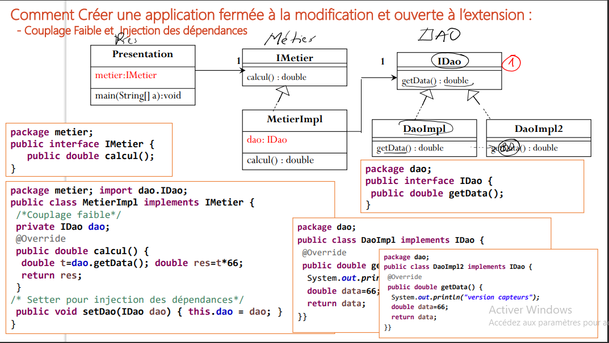
<h2>Realisation</h2>
<h3>Injection des dependances</h3>
<h4>1-Instanciation Statique</h4>
<h5>Code source</h5>

<h5>Resultat d'execution</h5>
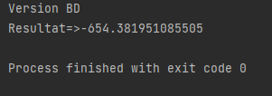
<h4>2-Instanciation Dynamique</h4>

pour appliquer le concept d'injection des dependances on utilisant l'instanciation dynamique on utilise un fichier de configuration qui contient les noms des implaimentations avec lequelle on vas travailée

<h5>Code source</h5>
<ul>
<li>Fichier de configuration</li>
 
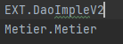
<li>Couche presentation</li>
 
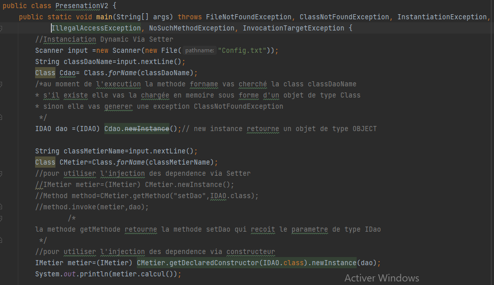
</ul>
<h5>Resultat d'execution</h5>
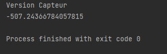
<h4>3-Spring version xml</h4>

pour appliquer le concept d'injection des dependances on utilisant SPRING version XML on utilise un fichier de configuration .xml qui contient les noms des implaimentations avec lequelle on vas travailée  et l'ensemble des traitements sous format des balise xml

<h5>Code source</h5>
<ul>
<li>Fichier .xml</li>
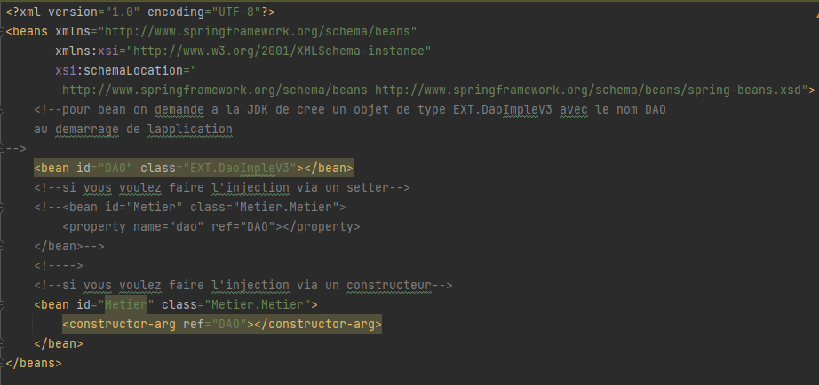
 
<li>Couche Presentation</li>
 
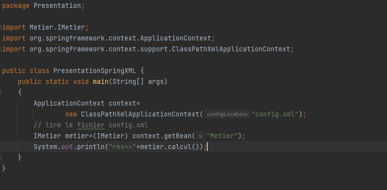
</ul>
<h5>Resultat d'execution</h5>
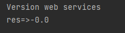
<h4>4-Spring version annotation</h4>

pour appliquer le concept d'injection des dependances on utilisant SPRING version    annotation, on est plus besoin des fichiers de configuration on est just besoin des annotation Component et Autowired

<ul>
<li>Component est une annotation qui permet à Spring de détecter automatiquement nos beans personnalisés. En d'autres termes, sans avoir à écrire de code explicite, Spring va : Analyser notre application pour les classes annotées avec @Component. Instanciez-les et injectez-y toutes les dépendances spécifiées</li>
<li>Autowired:La fonction Autowired du framework Spring vous permet d'injecter implicitement la dépendance de l'objet. Il utilise en interne l'injection de setter ou de constructeur. Le câblage automatique ne peut pas être utilisé pour injecter des valeurs primitives et de chaîne. Cela fonctionne uniquement avec référence.</li>
</ul>
<h5>Code source</h5>
<ul>
<li>Implaimentation Dao utilisée</li>
 
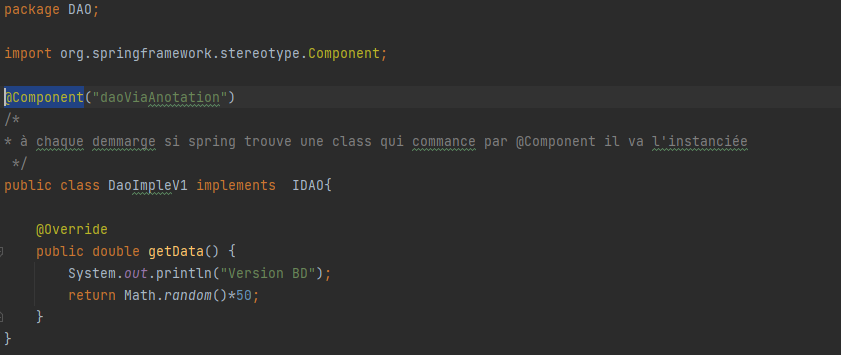
 
<li>Implaimentation Metier Utilisée</li>
 
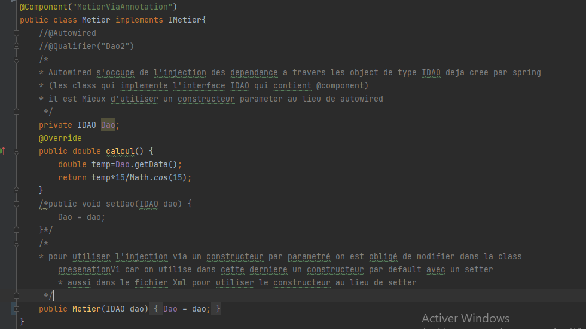
 
<li>Couche presentation</li>
 
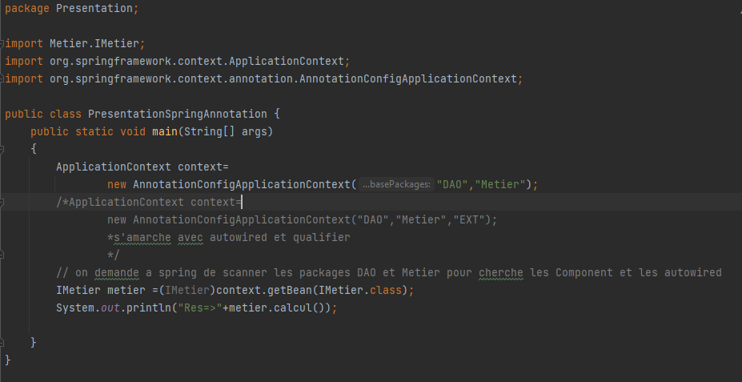
</ul>
<h5>Resultat d'execution</h5>

<h2>Conclusion</h2>

le concept d'inversion de controle et d'injection des dependances nous aide comme des devoleppeur de créé des application ouverte a l'extension et fermée a la modification et aussi de concentrée sur la code metier et deleguer le code technique a un framwork comme spring
